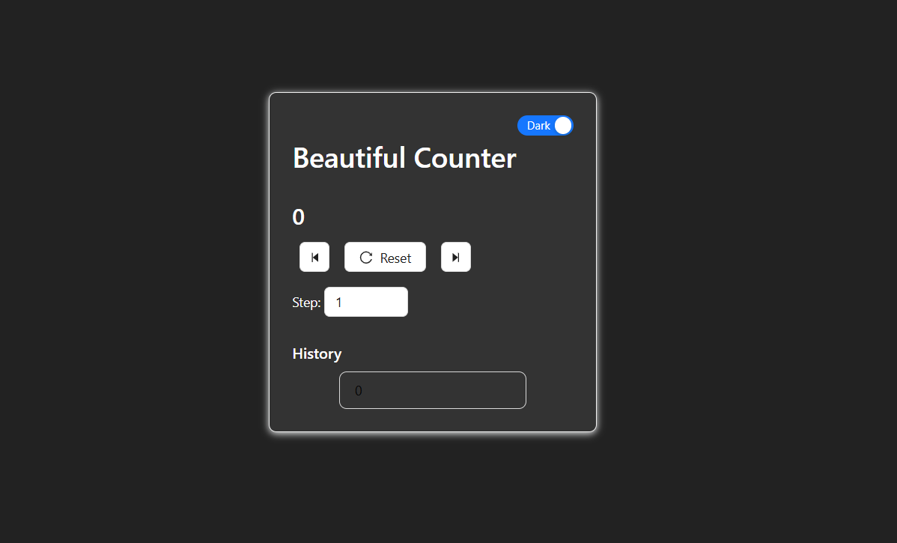

# Beautiful Counter

A modern, interactive counter application built with React and Ant Design. This project demonstrates state management, UI theming, and user experience best practices.

## Features

- **Increment/Decrement**: Increase or decrease the counter by a customizable step.
- **Step Selection**: Choose a step value between 1 and 5.
- **Reset**: Instantly reset the counter to zero.
- **History**: View the last five counter values.
- **Dark/Light Mode**: Toggle between dark and light themes.
- **Value Limits**: Counter is limited between -10 and 10.

## Screenshots

<<<<<<< HEAD
 
=======
 <!-- Add a screenshot if available -->
>>>>>>> 4fb5e126919e26d848d3314cde8f8b14887e5399

## Getting Started

### Prerequisites

- [Node.js](https://nodejs.org/) (v14 or higher recommended)
- [npm](https://www.npmjs.com/) or [yarn](https://yarnpkg.com/)

### Installation

1. Clone the repository:
   ```sh
   git clone https://github.com/SandunPahasara/Counter.git
   cd counter/Counter
   ```

2. Install dependencies:
   ```sh
   npm install
   # or
   yarn install
   ```

3. Start the development server:
   ```sh
   npm start
   # or
   yarn start
   ```

4. Open [http://localhost:3000](http://localhost:3000) to view it in your browser.

## Project Structure

- `src/App.js` - Main application component
- `src/App.css` - Styling for the app

## Technologies Used

- [React](https://reactjs.org/)
- [Ant Design](https://ant.design/)
- [JavaScript (ES6+)](https://developer.mozilla.org/en-US/docs/Web/JavaScript)

## Customization

You can easily modify the min/max values, step range, or UI styles in `src/App.js` and `src/App.css`.

## License

This project is licensed under the MIT License.

---
